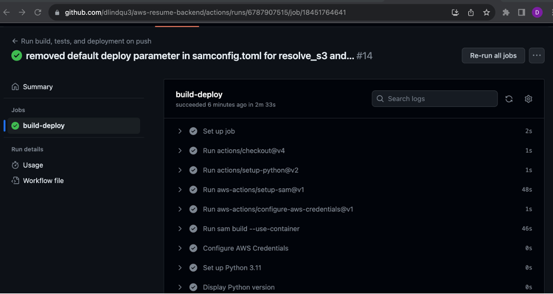
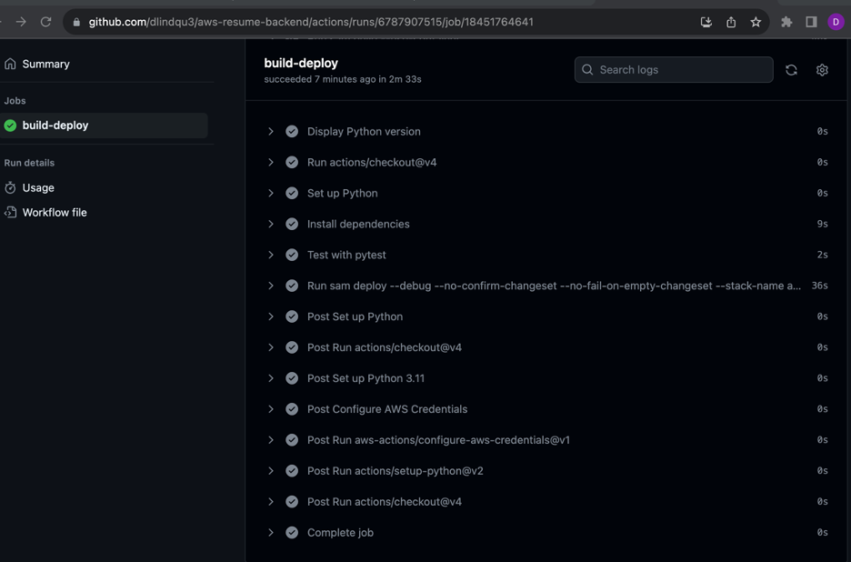

## The Cloud Resume Challenge - AWS - Backend
- The website [Cloud Resume Challenge](https://cloudresumechallenge.dev/docs/the-challenge/aws/) describes a sample AWS cloud project that involves hosting a resume copy on AWS 
- The background of the project is built with tools like AWS SAM, API Gateway, Lambda, and DynamoDB 
- My iteration of the project followed similar guidelines, but  added other services / capabilities as I saw fit 

### Steps to push code (without GitHub Actions)
1. terminal: "sam build" 
2. terminal: "sam deploy --guided" 
  - this command is also used for updates

### link to frontend repo & deployed site 
- https://github.com/dlindqu3/aws-resume
- https://cloud-resume-dlindqu.com/ 

## link to medium article 
- https://medium.com/@dwight.lindquist/aws-sam-setup-for-lambda-api-gateway-and-dynamodb-542c46f1ff76 

### GitHub Actions screenshots 

### sources
1. AWS Documentation, "Tutorial: Deploying a Hello World application", [link](https://docs.aws.amazon.com/serverless-application-model/latest/developerguide/serverless-getting-started-hello-world.html)
2. Stack Overflow, "How to enable CORS with AWS SAM", [link](https://stackoverflow.com/questions/67065130/how-to-enable-cors-with-aws-sam)
3. AWS Events, "AWS re:Invent 2022 - Building real-world serverless applications with AWS SAM (SVS303)", [link](https://www.youtube.com/watch?v=jZcS-XRt2Mo)
4. Stack Overflow, "Import "boto3" could not be resolved/Python, VS Code", [link](https://stackoverflow.com/questions/65933570/import-boto3-could-not-be-resolved-python-vs-code)
5. AWS Documentation, "Get an item from a DynamoDB table using an AWS SDK", [link](https://docs.aws.amazon.com/amazondynamodb/latest/developerguide/example_dynamodb_GetItem_section.html)
6. Python Documentation, "8. Errors and Exceptions", [link](https://docs.python.org/3/tutorial/errors.html)
7. Davide de Paolis, "Quickly test your AWS API Gateway with Postman", [link](https://dev.to/dvddpl/quickly-test-your-aws-api-gateway-with-postman-586p) 
8. AWS Documentation, "AWS SAM policy templates", [link](https://docs.aws.amazon.com/serverless-application-model/latest/developerguide/serverless-policy-templates.html)
9. AWS Documentation, "Put an item in a DynamoDB table using an AWS SDK", [link](https://docs.aws.amazon.com/amazondynamodb/latest/developerguide/example_dynamodb_PutItem_section.html)
10. DigitalOcean, "How To Use the JavaScript Fetch API to Get Data", [link](https://www.digitalocean.com/community/tutorials/how-to-use-the-javascript-fetch-api-to-get-data) 
11. Travis Luong, "How to Test an API with Pytest and Requests", [link](https://www.travisluong.com/how-to-test-an-api-with-pytest-and-requests/)
12. GitHub Documentation "Building and testing Python", [link](https://docs.github.com/en/actions/automating-builds-and-tests/building-and-testing-python#testing-your-code)
13. Julian Wood, "Using GitHub Actions to deploy serverless applications", [link](https://aws.amazon.com/blogs/compute/using-github-actions-to-deploy-serverless-applications/)
14. AWS Documentation, "Default configuration file settings", [link](https://docs.aws.amazon.com/serverless-application-model/latest/developerguide/serverless-sam-cli-config.html#serverless-sam-cli-config-default)